**Framework de Governança de IA para Operações Críticas**

*   **Descrição:** Desenvolvimento de um framework prático e adaptável para governança de soluções de Inteligência Artificial em ambientes de operações críticas (telecom, redes, datacenter). O framework abordaria aspectos como ética, segurança, conformidade regulatória (LGPD, por exemplo), monitoramento de desempenho e mitigação de riscos.
*   **Objetivo:** Fornecer um guia estruturado para a implementação segura e eficaz de IA em infraestruturas críticas, garantindo conformidade e minimizando riscos operacionais.
*   **Problema que resolve:** A falta de diretrizes claras para governar o uso de IA em ambientes sensíveis, levando a riscos de segurança, conformidade e desempenho.
*   **Público Beneficiado:** Gerentes de projeto, líderes de TI, equipes de segurança da informação e profissionais de operações em setores regulados.
*   **Entregável Possível:** Um documento de framework detalhado (playbook/guia), incluindo templates, checklists e um protótipo de dashboard de monitoramento de governança.

```mermaid
flowchart TD
    classDef default fill:#d0d0d0,stroke:#ffffff,stroke-width:2px,color:#000000
    classDef header fill:#b0b0b0,stroke:#ffffff,stroke-width:2px,color:#ffffff

    subgraph Princ ["Princípios Fundamentais"]
    direction TB
        P1(Transparência)
        P2(Justiça e Equidade)
        P3(Responsabilidade)
        P4(Privacidade)
        P1 --- P2 --- P3 --- P4
    end

    subgraph ETI ["Pilar 1: Ética"]
    direction TB
        E1(Princípios Éticos)
        E2(Viés e Discriminação)
        E3(Impacto Social)
        E4(Valores Humanos)
        E1 --- E2 --- E3 --- E4
    end

    subgraph RIS ["Pilar 2: Riscos"]
    direction TB
        R1(Identificação de Riscos)
        R2(Avaliação de Impacto)
        R3(Mitigação)
        R4(Monitoramento)
        R1 --- R2 --- R3 --- R4
    end

    subgraph CON ["Pilar 3: Conformidade"]
    direction TB
        C1(Regulamentações)
        C2(Auditorias)
        C3(Relatórios)
        C4(Certificações)
        C1 --- C2 --- C3 --- C4
    end

    subgraph INO ["Pilar 4: Inovação"]
    direction TB
        I1(Desenvolvimento Seguro)
        I2(Colaboração)
        I3(Atualizações)
        I4(Escalabilidade)
        I1 --- I2 --- I3 --- I4
    end

    subgraph GOV ["Pilar 5: Governança"]
    direction TB
        G1(Estruturas Organizacionais)
        G2(Políticas)
        G3(Treinamentos)
        G4(Accountability)
        G1 --- G2 --- G3 --- G4
    end

    subgraph APR ["Aprimoramento Contínuo"]
    direction TB
        A1(Feedback e Aprendizado)
        A2(Avaliações Periódicas)
        A3(Melhorias Iterativas)
        A4(Adaptação)
        A1 --- A2 --- A3 --- A4
    end

    Princ --> ETI
    ETI --> RIS
    RIS --> CON
    CON --> INO
    INO --> GOV
    GOV --> APR

    class P1,P2,P3,P4,E1,E2,E3,E4,R1,R2,R3,R4,C1,C2,C3,C4,I1,I2,I3,I4,G1,G2,G3,G4,A1,A2,A3,A4 default

```

